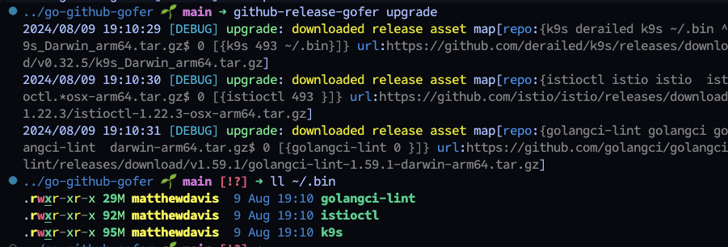

# GitHub Release Gofer 🚀


Gofer is a tool for downloading, upgrading, and installing GitHub releases.



## Installation

```bash
go install github.com/mateothegreat/github-release-gofer@latest
```

## Usage

```bash
gofer upgrade
```

### Flags

| Flag               | Description                     |
| ------------------ | ------------------------------- |
| `-f`, `--file`     | Path to the configuration file. |
| `-p`, `--path`     | Path to install the release.    |
| `-d`, `--download` | Download file name or regex.    |
| `-m`, `--matcher`  | File name or regex to match.    |

## Configuration

Gofer is configured using a `.gofer.yaml` file in the current directory or any parent directory such as `~/.gofer.yaml`.

| Example Path           | Description                |
| ---------------------- | -------------------------- |
| `.gofer.yaml`          | Local configuration file.  |
| `.github-gofer.yaml`   | Local configuration file.  |
| `~/.gofer.yaml`        | Global configuration file. |
| `~/.github-gofer.yaml` | Global configuration file. |

## Example

Running `gofer upgrade` will download the latest release(s) configured in the `.gofer.yaml` file and install it to the configured path, or home directory by default:

```bash
gofer upgrade
```

```yaml
path: ~/.bin # Global path for all repos (optional).
repos:
  - name: k9s
    owner: derailed
    repo: k9s
    path: ~/.bin # Local path for this repo (optional).
    download: ^k9s_Darwin_arm64.tar.gz$ # Download file name or regex (optional).
    matchers:
      - pattern: k9s # File name or regex (optional).
        path: ~/.bin # Local path for this file (optional).
        mode: 755 # File mode (optional).
  - name: istioctl
    owner: istio
    repo: istio
    download: istioctl.*osx-arm64.tar.gz$
    matchers:
      - pattern: istioctl
        mode: 755
  - name: golangci-lint
    owner: golangci
    repo: golangci-lint
    download: darwin-arm64.tar.gz$
    matchers:
      - pattern: golangci-lint
  - name: ktop
    owner: vladimirvivien
    repo: ktop
    download: ktop_v0.3.7_darwin_arm64.tar.gz
    matchers:
      - pattern: ^ktop$
        mode: 755
  - name: dbee
    owner: murat-cileli
    repo: dbee
    download: .*_Darwin_arm64.tar.gz$
    matchers:
      - pattern: dbee
        mode: 755
```
